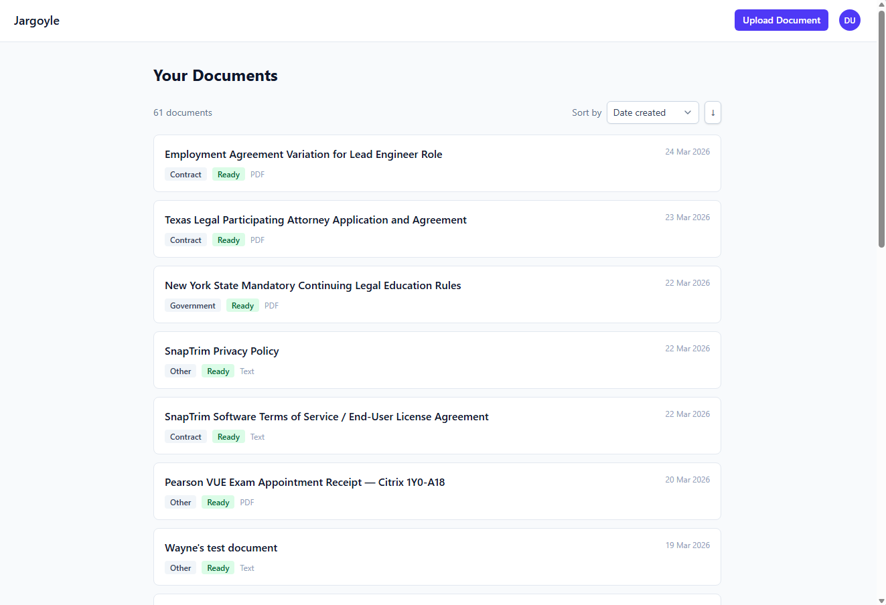
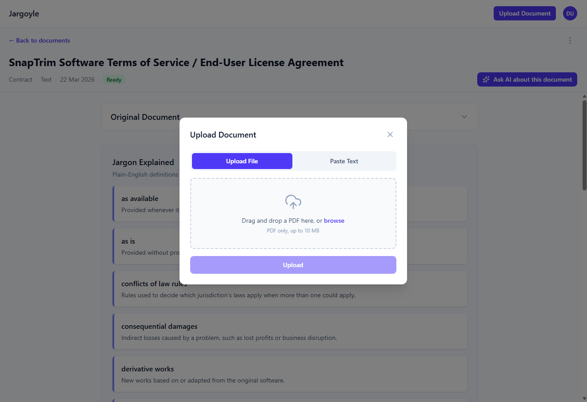
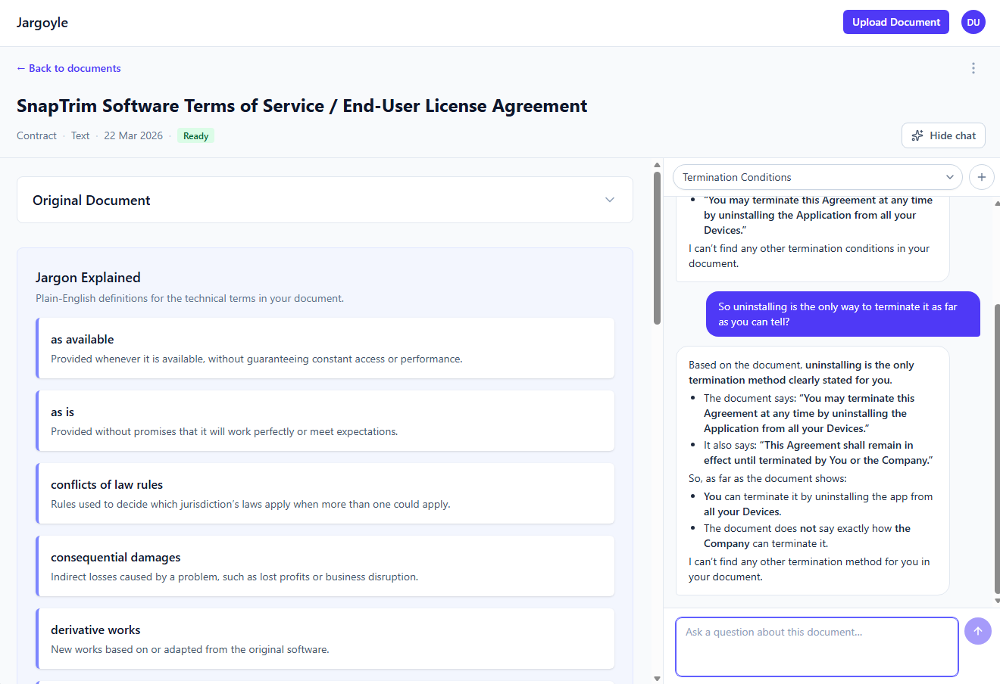
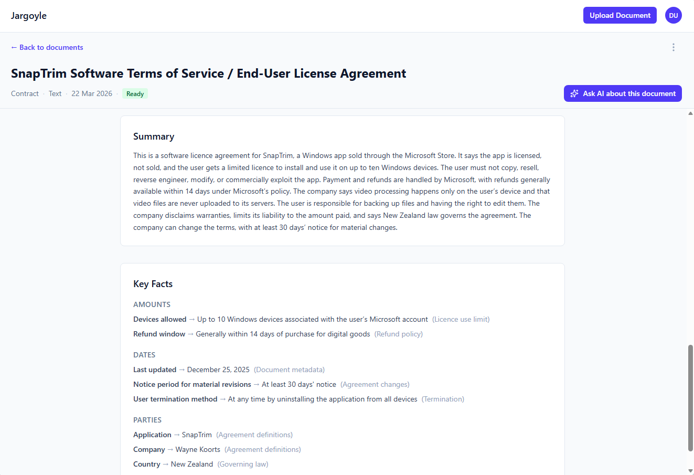
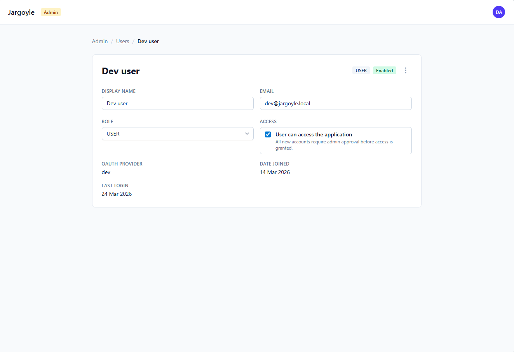

# Jargoyle

[](https://github.com/WayneKoorts/Jargoyle/actions/workflows/ci.yml)
[](LICENCE)


*Guarding you from the fine print.*

Jargoyle is a document explanation tool. Upload everyday documents — phone bills, insurance policies, rental agreements, bank terms — and get a plain-English summary with key facts highlighted. Then ask follow-up questions in a conversational chat, with every answer grounded in your actual document.

## Screenshots

### Document list

Browse all your uploaded documents, each tagged by category.



### Upload a document

Drag and drop a PDF, or paste text directly.



### Document details

Read the original text alongside plain-English jargon explanations, and ask follow-up questions in the chat pane.



### Summary & Key Facts

Get an AI-generated summary, key facts, and extracted metadata at a glance.



### Admin panel

Manage users, roles, and access from the admin dashboard.



## Tech Stack

**Backend:** Java 25, Spring Boot 4, Gradle (Kotlin DSL), PostgreSQL (+ pgvector planned), Spring AI, Flyway

**Frontend:** React 19, TypeScript, Vite, Tailwind CSS, Vitest

## Getting Started

### Prerequisites

- Java 25
- PostgreSQL (pgvector extension needed later for RAG/embeddings)
- Node.js (for the frontend)

### Build & Run

**Backend** — all commands run from `src/backend/`:

```bash
./gradlew build      # Compile, test, and package
./gradlew test       # Run tests only
./gradlew bootRun    # Start the application
```

**Frontend** — all commands run from `src/frontend/`:

```bash
npm install          # Install dependencies
npm run dev          # Start dev server
npm run build        # Production build
npm test             # Run tests
```

**Docker Compose** — a `compose.yml` is provided at the project root for local services (e.g. PostgreSQL).

## Repository Structure

```
jargoyle/
├── src/
│   ├── backend/     # Spring Boot application
│   └── frontend/    # React SPA
└── design/          # Specification and design documents
```

See the [backend architecture](src/backend/README.md#architecture) and [frontend architecture](src/frontend/README.md#architecture) guides for detailed breakdowns and diagrams.

## Further Reading

See [`design/1-jargoyle-spec.md`](design/1-jargoyle-spec.md) for the full project specification.

## Licence

This project is licensed under the [GNU General Public Licence v3.0](LICENCE).
