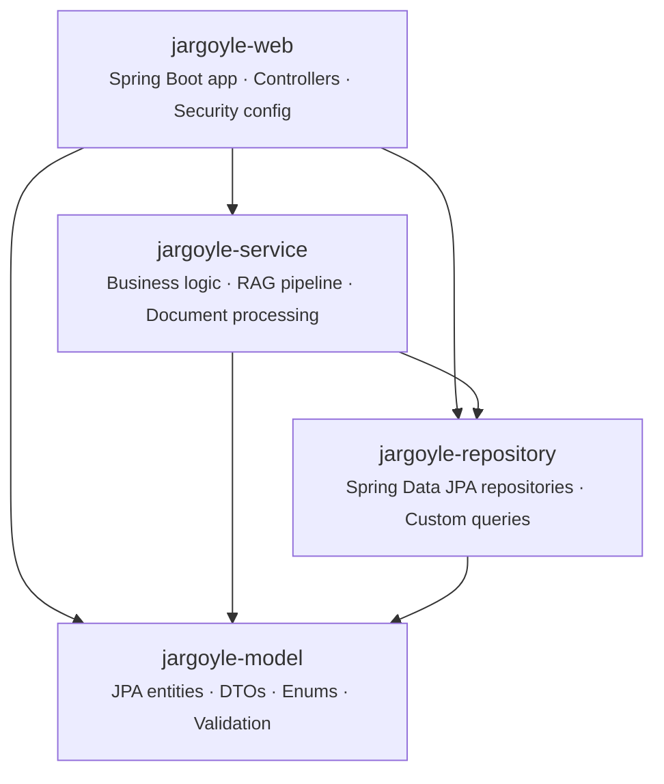
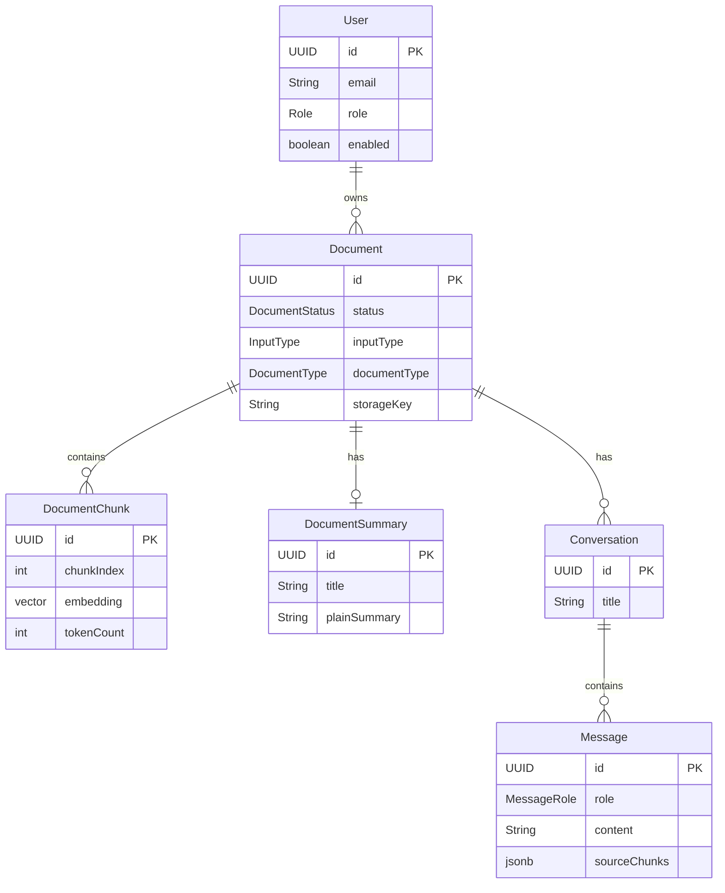
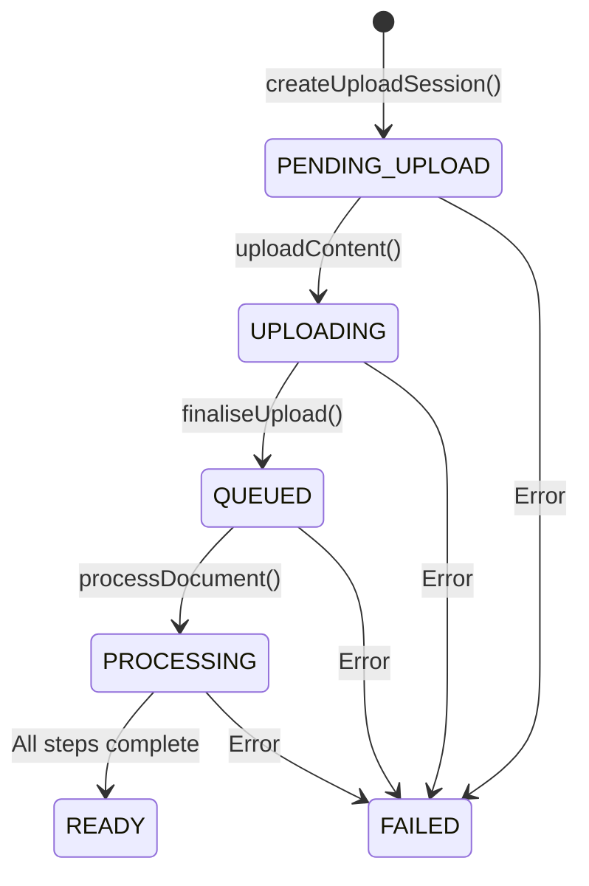
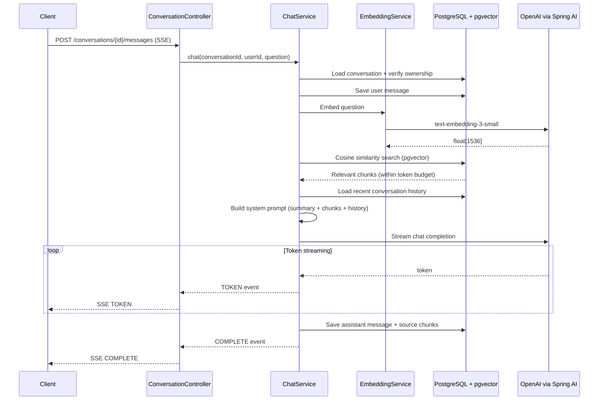

# Jargoyle Backend

Spring Boot application powering the Jargoyle API.

## Architecture

### Module Structure

The backend is a Gradle multi-project build with four sub-projects. Each arrow below is a compile-time dependency — `jargoyle-model` is the leaf module with no internal dependencies, and `jargoyle-web` is the Spring Boot entry point that pulls everything together.



### Entity Relationships

Five core JPA entities, all keyed by UUID with auto-managed timestamps:



### Document Processing Pipeline

When a user uploads a document, it moves through a state machine tracked by the `DocumentStatus` enum. The async processing phase runs on a dedicated thread pool (`documentProcessingExecutor`).



During the **PROCESSING** phase, four services run in sequence:

1. **TextExtractionService** — extracts plain text from PDFs (via Apache PDFBox)
2. **ChunkingService** — splits text into token-budgeted sections using structural analysis and sentence boundaries
3. **EmbeddingService** — batch-embeds all chunks via OpenAI `text-embedding-3-small` (1536 dimensions)
4. **SummaryGenerationService** — asks the LLM to produce a title, plain summary, key facts, and flagged terms

SSE notifications are pushed to the client at each stage via `DocumentStatusNotifier`.

### RAG Chat Pipeline

The `ChatService` orchestrates the retrieval-augmented generation flow. It returns a cold `Flux<ChatStreamEvent>` that streams `TOKEN`, `COMPLETE`, and `ERROR` events over SSE.



### Security

- **OAuth2/OIDC login** — `CustomOidcUserService` finds or creates a local `User` on login and injects the database role (e.g. `ROLE_ADMIN`) as a `GrantedAuthority` into the Spring Security context
- **Disabled account filter** — `EnabledUserFilter` rejects requests from users whose `enabled` flag is `false` (new accounts require admin approval)
- **Method-level security** — `@EnableMethodSecurity` activates `@PreAuthorize` annotations (e.g. `hasRole('ADMIN')` on admin endpoints)
- **CSRF** — disabled for `/api/**` since the SPA uses JSON `fetch` with session cookies, not form submissions

## Prerequisites

- Java 25
- [Podman](https://podman.io/) (or Docker)

## Setup

1. Copy the environment file at the repo root and adjust if needed:
   ```bash
   cp ../../.env.example ../../.env
   ```

2. Start the full stack (app + PostgreSQL) from the repo root:
   ```bash
   podman compose --profile dev up --build
   ```

The application will be available at `http://localhost:8080`.

## Local Development

For day-to-day coding, run only the database in a container and launch the app from your IDE for faster restarts and debugger access:

```bash
podman compose --profile dev up db
```

Then start the application from your IDE with the Spring profile set to `dev`. The default database credentials in `application-dev.yml` match the container's defaults, so no extra configuration is needed unless you've changed them in `.env`.

## Gradle Commands

Run these from `src/backend/`:

```bash
./gradlew build      # Compile, test, and package
./gradlew test       # Run tests only
./gradlew bootRun    # Start the application
```

## API Testing (Dev Only)

When running with the `dev` profile, you can authenticate without going through OAuth by calling the dev login endpoint:

```
POST http://localhost:8080/api/dev/login
```

This creates a test user with the `USER` role and returns a session cookie (`JSESSIONID`). Include that cookie in subsequent requests to access authenticated endpoints. Most API clients (Postman, Insomnia, HTTPie, etc.) handle cookies automatically — just make sure cookie storage is enabled.

To test admin-only features, use the admin login endpoint instead:

```
POST http://localhost:8080/api/dev/login-admin
```

This creates a separate test user with the `ADMIN` role, granting access to `/api/admin/**` endpoints and the admin dashboard UI.

Both endpoints only exist in the `dev` profile. In production, they return 404.

## Stopping

Stop the containers with the same profile you used to start them:

```bash
podman compose --profile dev down
```

Add `-v` to also remove the database volume.
