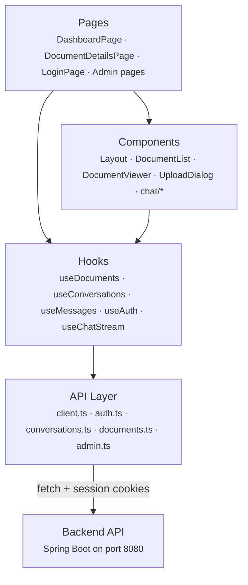
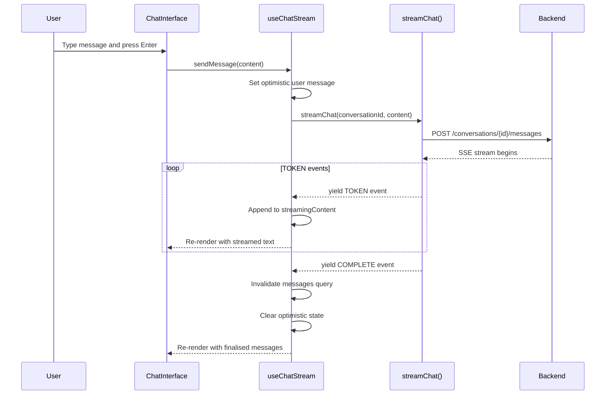
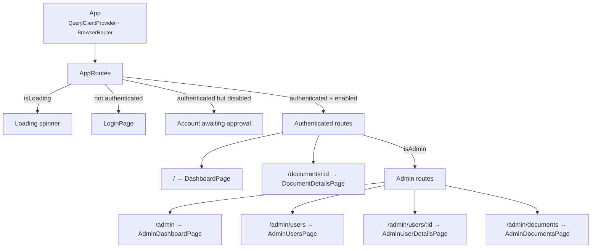

# Jargoyle Frontend

React SPA for the Jargoyle document explanation tool.

## Architecture

### Layer Structure

The frontend follows a four-layer architecture. Data flows downward — pages compose components, components call hooks, and hooks use the API layer to communicate with the backend.



Two data-fetching patterns coexist:

- **React Query** (`@tanstack/react-query`) drives all standard request/response operations — document CRUD, conversations, messages, auth. It provides caching, automatic refetch, and loading/error states.
- **Custom `useState` hooks** handle SSE streaming (`useChatStream`, `useDocumentStatus`), where the server pushes events incrementally and the response doesn't fit React Query's request/response model.

### Chat Streaming Flow

The chat interface uses an optimistic UI pattern — the user's message appears instantly while the assistant's response streams in token-by-token via Server-Sent Events. The API uses `fetch` + `ReadableStream` (not `EventSource`, which only supports GET).



### Routing and Auth

All routes are gated behind authentication. The `AppRoutes` component checks session state via `useAuth()` before rendering any route. Admin routes are conditionally registered based on the user's role.



## Tech Stack

- **React 19** + TypeScript
- **Vite** — dev server and build tooling
- **Tailwind CSS v4** — utility-first styling
- **TanStack Query** — server state management
- **React Router** — client-side routing

## Getting Started

```bash
npm install
npm run dev
```

The dev server starts at `http://localhost:5173`. API requests to `/api`, `/oauth2`, `/login`, and `/logout` are proxied to the backend on `http://localhost:8080`.

## Testing

- **Vitest** — test runner (shares Vite's transform pipeline)
- **React Testing Library** — component testing
- **MSW (Mock Service Worker)** — API mocking at the network level

Tests are co-located alongside source files (e.g. `DocumentList.tsx` / `DocumentList.test.tsx`). Shared test infrastructure lives in `src/test/`.

## Scripts

| Command | Description |
|---------|-------------|
| `npm run dev` | Start dev server with HMR |
| `npm run build` | Production build to `dist/` |
| `npm run preview` | Preview the production build locally |
| `npm run lint` | Run ESLint |
| `npm test` | Run tests once |
| `npm run test:watch` | Run tests in watch mode |
